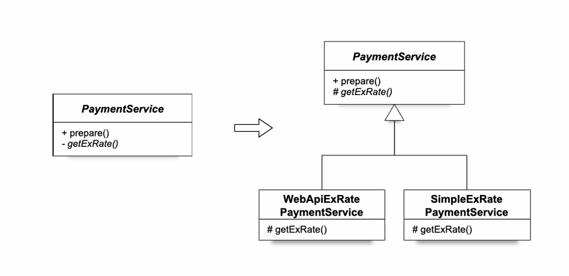

# 03.상속을 통한 확장

Payment 의  변경  없이  환율  정보를  가져오는  방법을  확장하게  만들려면  상속을  이용할  수  있다 . 어떻게 Payment 를  준비할  것이가와  어떻게  환율을  가져올  것인가라는  관심사가  클래스  레벨에서  분리된다 . 환율  정보를  담은  오브젝트인 ExRate 를  생성하는  책임을  서브  클래스에게  위임하는  방식이다 . 객체지향  디자인  패턴에  나오는  팩토리  메소드  패턴을  이용한다 . 



`getExRate` 메서드를 상속을 통해 기능을 확장해 사용할 수 있게 변경할 예정.

다른 곳에서 재사용할 때 커스텀해서 사용해야한다고 할때 이를 가능하게 해보자.

- 원본

  ```java
      private BigDecimal getExRate(String currency) throws IOException {
          URL url = new URL("<https://open.er-api.com/v6/latest/>" + currency);
          HttpURLConnection connection = (HttpURLConnection) url.openConnection();
          BufferedReader br = new BufferedReader(new InputStreamReader(connection.getInputStream()));
          String response = br.lines().collect(Collectors.joining());
          br.close();
  
          ObjectMapper mapper = new ObjectMapper();
          ExRateData data = mapper.readValue(response, ExRateData.class);
          BigDecimal exRate = data.rates().get("KRW"); // 환율 꺼내오기.
          return exRate;
      }
  ```

- 상속으로 확장 형태

  - **PaymentService (추상클래스로 변경)**

    ```java
    package tobyspring.hellospring;
    
    import java.io.IOException;
    import java.math.BigDecimal;
    import java.time.LocalDateTime;
    
    **abstract** public class PaymentService {
        public Payment prepare(Long orderId, String currency, BigDecimal foreignCurrencyAmount) throws IOException {
            BigDecimal exRate = getExRate(currency);
            BigDecimal convertedAmount = foreignCurrencyAmount.multiply(exRate);
            LocalDateTime validUntil = LocalDateTime.now().plusMinutes(30);
    
            return new Payment(orderId, currency, foreignCurrencyAmount, exRate, convertedAmount, validUntil);
        }
    
        abstract BigDecimal getExRate(String currency) throws IOException;
    
    }
    ```

  - **WebApiExRatePaymentService (추상클래스 상속받음)**

    ```java
    package tobyspring.hellospring;
    
    import com.fasterxml.jackson.databind.ObjectMapper;
    
    import java.io.BufferedReader;
    import java.io.IOException;
    import java.io.InputStreamReader;
    import java.math.BigDecimal;
    import java.net.HttpURLConnection;
    import java.net.URL;
    import java.util.stream.Collectors;
    
    public class WebApiExRatePaymentService **extends PaymentService** {
        @Override
        BigDecimal getExRate(String currency) throws IOException {
            URL url = new URL("<https://open.er-api.com/v6/latest/>" + currency);
            HttpURLConnection connection = (HttpURLConnection) url.openConnection();
            BufferedReader br = new BufferedReader(new InputStreamReader(connection.getInputStream()));
            String response = br.lines().collect(Collectors.joining());
            br.close();
    
            ObjectMapper mapper = new ObjectMapper();
            ExRateData data = mapper.readValue(response, ExRateData.class);
            BigDecimal exRate = data.rates().get("KRW"); // 환율 꺼내오기.
            return exRate;
        }
    }
    ```

  - **SimpleExRatePaymentService (커스텀해서 사용하는 경우)**

    환율을 KRW가 아닌 USD를 적용해야할 때.

    ```java
    package tobyspring.hellospring;
    
    import java.io.IOException;
    import java.math.BigDecimal;
    
    public class SimpleExRatePaymentService  extends PaymentService{
        @Override
        BigDecimal getExRate(String currency) throws IOException {
            if(currency.equals("USD")) return BigDecimal.valueOf(1000);
    
            throw new IllegalArgumentException("지원하지 않는 통화입니다.");
        }
    }
    ****
    ```

  - **Client (실행)**

    `WebApiExRatePaymentService` , `SimpleExRatePaymentService` 각 정책에 맞게 코드를 구현해서 사용할 수 있게된다.

    ```java
    package tobyspring.hellospring;
    
    import java.io.IOException;
    import java.math.BigDecimal;
    
    public class Client {
        public static void main(String[] args) throws IOException {
    //        PaymentService paymentService = new WebApiExRatePaymentService();
            PaymentService paymentService = new SimpleExRatePaymentService();
            Payment payment = paymentService.prepare(100L, "USD", BigDecimal.valueOf(50.7));
            System.out.println(payment);
        }
    }
    ```

# 한계

- 만약 환율을 적용할 때 VIP 에게는 더 낮은 환율을 적용하는 정책이 있다고 하면, 새로운 클래스를 만들어야함.
- 현재 서비스에서는 장기적으로는 적합하지않음
- 다음 시간에 이를 극복하는 방법을 알아본다.